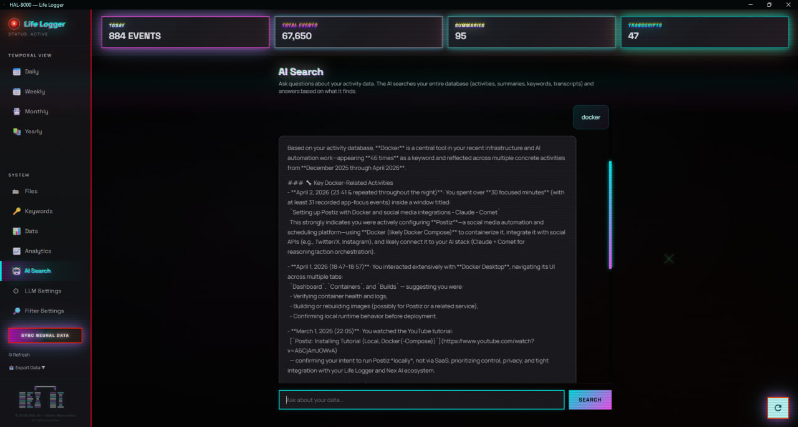
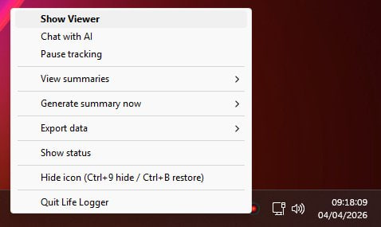
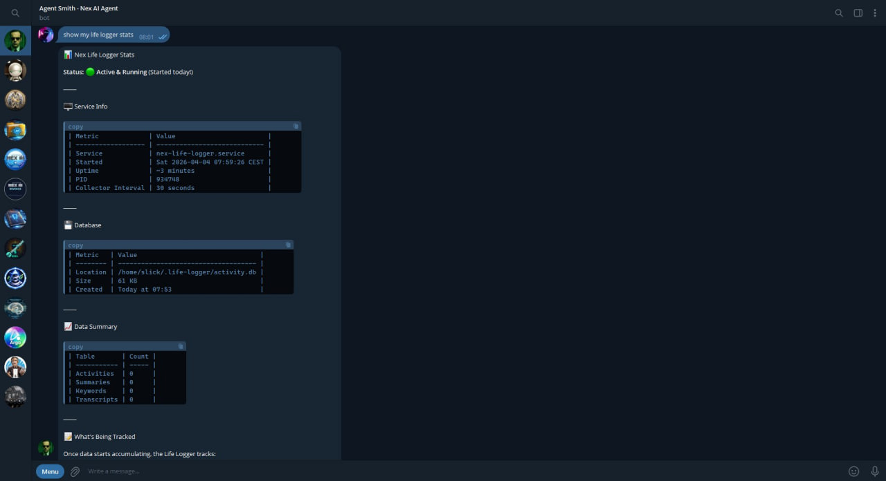

# Nex Life Logger

**Your AI agent remembers everything you did on your computer.**

Privacy-first local activity tracker that captures your browsing history, active windows, and YouTube videos, then lets you query it all with AI. Every byte stays on your machine.

67,000+ activities tracked. Zero data sent to the cloud.


### AI Search - Ask anything about your computer activity


### System Tray - Runs silently in the background


### Agent Integration - Query through Telegram, Discord, or WhatsApp


## What It Does

Nex Life Logger runs silently in the background and tracks:

- **Browser history** from Chrome, Edge, Brave, and Firefox
- **Active window focus** (which app you're using and when)
- **YouTube videos** you watch (with full transcript capture)
- **Search queries** from Google, Bing, DuckDuckGo, and more

Then it generates AI-powered summaries at every level (daily, weekly, monthly, yearly) so you can ask your AI agent things like:

> "What was I working on yesterday afternoon?"
> "How much time did I spend on YouTube this week?"
> "Search my history for anything related to Docker"
> "What were the main topics I researched in March?"

## Privacy First

- All data stored locally in `~/.life-logger/` (SQLite)
- No cloud sync, no telemetry, no analytics, no account required
- Chat/messaging apps are automatically excluded (WhatsApp, Discord, Slack, Telegram, Signal, Teams, etc.)
- Sensitive windows (password managers, banking) are never logged
- Only productive content is tracked (AI, programming, design, learning). Entertainment, politics, and news are filtered out
- API keys stored via Windows Credential Manager / DPAPI (never in plain text)

## Two Ways to Use It

### 1. Desktop Application (Windows, macOS, Linux)

Full desktop app with system tray icon, native viewer window with themes, AI chat, analytics charts, and data export.

```bash
# Install dependencies
pip install -r requirements.txt

# Run with system tray icon
python tray.py
```

Right-click the tray icon to pause/resume tracking, view summaries, force a summary, or open the AI chat.

**Desktop features:**

- 3 themes (Cyberpunk, Executive Chronicle, Neon Pulse)
- AI-powered natural language search across your entire history
- Chart.js analytics visualizations
- Conversational AI chat with database context
- Data export (JSON, CSV, HTML reports)
- Auto-start on login (Windows)
- Configurable content filters (12 categories)

### 2. OpenClaw / ClawHub Skill (AI Agent Integration)

Install the skill and query your activity data through any OpenClaw-connected agent (Telegram, Discord, WhatsApp, etc.).

```bash
npx clawhub install nex-life-logger
bash setup.sh
```

Then message your agent:

```
You: "What was I working on yesterday?"
Agent: *runs nex-life-logger activities --last 1d*
Agent: "Yesterday you spent most of your time on..."
```

**Available on ClawHub:** [clawhub.ai/nex-life-logger](https://clawhub.ai/nexaiguy/nex-life-logger)

## CLI Commands

The ClawHub skill includes a full CLI for querying your data:

```bash
# Search across all data (FTS5 powered, with relevance ranking)
nex-life-logger search "docker containers"
nex-life-logger search "machine learning" --since 2026-03-01
nex-life-logger search "react" --kind url --source chrome --limit 50
nex-life-logger search "python" --kind app_focus
nex-life-logger search "kubernetes" --category tool
nex-life-logger search "AI agents" --output json

# View AI summaries
nex-life-logger summary daily
nex-life-logger summary weekly
nex-life-logger summary monthly

# Browse raw activities
nex-life-logger activities --last 2h
nex-life-logger activities --kind youtube
nex-life-logger activities --kind search

# Keywords and topics
nex-life-logger keywords --top 20
nex-life-logger keywords --category tool

# YouTube transcripts
nex-life-logger transcript <video_id>
nex-life-logger transcripts --last 7d

# Statistics
nex-life-logger stats

# Generate summaries on demand
nex-life-logger generate daily
nex-life-logger generate weekly

# Export your data
nex-life-logger export json --output backup.json
nex-life-logger export csv --output activities.csv
nex-life-logger export html --output report.html

# Service management
nex-life-logger service status
nex-life-logger service start
nex-life-logger service stop
```

## Example Agent Conversations

**Productivity review:**
```
You: "Show me my productivity summary for last week"
Agent: *runs nex-life-logger summary weekly*
Agent: "Last week you focused heavily on React component architecture
        and Docker deployment. You watched 3 YouTube tutorials on
        Kubernetes and spent significant time on GitHub reviewing PRs..."
```

**Research recall:**
```
You: "What YouTube videos did I watch about machine learning?"
Agent: *runs nex-life-logger search "machine learning"*
Agent: "You watched 5 ML-related videos this month:
        - 'Fine-tuning LLMs with LoRA' (45 min, covered adapter layers...)
        - 'RAG Pipeline Architecture' (32 min, discussed vector stores...)"
```

**Tool tracking:**
```
You: "What tools and languages have I been using the most?"
Agent: *runs nex-life-logger keywords --category tool --top 15*
Agent: "Your top tools this month: VS Code, Docker, Figma, Chrome DevTools.
        Languages: Python (dominant), TypeScript, SQL, Bash."
```

## How It Works

```
Collection (every 30 seconds)
  Browser history + active window + YouTube transcripts
    |
    v
  Filters: chat apps excluded, sensitive windows skipped,
           non-productive content filtered
    |
    v
  SQLite database (~/.life-logger/activity.db)
    |
    v
Summarization (scheduled)
  Daily (11 PM) -> Weekly (Sunday) -> Monthly (1st) -> Yearly (Jan 1)
  Each level summarizes the one below it
    |
    v
Querying (FTS5 full-text search with relevance ranking)
  CLI commands, AI search, or agent integration
```

## AI Provider Support

Works with any OpenAI-compatible API:

| Provider | Base URL | Notes |
|----------|----------|-------|
| Alibaba Qwen | `https://dashscope.aliyuncs.com/compatible-mode/v1` | Free tier available |
| OpenAI | `https://api.openai.com/v1` | GPT-4o, GPT-4o-mini |
| Groq | `https://api.groq.com/openai/v1` | Fast inference |
| Ollama | `http://localhost:11434/v1` | Fully local, no API key |
| Any compatible | Your endpoint | Any OpenAI-compatible server |

Configure with:
```bash
nex-life-logger config set-provider openai
nex-life-logger config set-api-key
nex-life-logger config set-model gpt-4o
nex-life-logger config set-api-base https://api.openai.com/v1
nex-life-logger config set-poll-interval 60
nex-life-logger config rebuild-fts
```

## Project Structure

```
life-logger/
├── tray.py                  # System tray app (recommended entry point)
├── main.py                  # CLI entry point (headless mode)
├── viewer.py                # Desktop viewer (pywebview, 3 themes)
├── ai_chat.py               # AI chat window with database context
├── collector.py             # Browser history + active window collector
├── storage.py               # SQLite database layer
├── summarizer.py            # AI summary generation (daily -> yearly)
├── scheduler.py             # Background scheduler for summaries + backups
├── youtube_transcript.py    # YouTube transcript fetcher
├── content_filter.py        # Productivity content classifier
├── chat_filter.py           # Chat/messaging exclusion filter
├── keyword_extractor.py     # Topic and keyword extraction
├── user_filters.py          # User-configurable filter settings
├── config.py                # Configuration constants
├── secure_key.py            # Secure API key storage (Credential Manager/DPAPI)
├── exporter.py              # Data export (JSON, CSV, HTML)
├── setup_autostart.py       # Windows auto-start setup
├── requirements.txt         # Python dependencies
├── clawhub-skill/           # OpenClaw/ClawHub skill package
│   ├── SKILL.md             # Skill definition for AI agents
│   ├── nex-life-logger.py   # CLI tool
│   ├── setup.sh             # One-command installer
│   └── lib/                 # Core library modules
└── Start Life Logger.bat    # Windows launcher
```

## Database Schema

Four tables in a single SQLite file:

- **activities**: every tracked browser visit and window focus event (67K+ rows and growing)
- **summaries**: AI-generated daily/weekly/monthly/yearly summaries
- **keywords**: extracted topics, tools, languages, and projects with frequency counts
- **transcripts**: full YouTube video transcripts (up to 100KB each)

## Requirements

- Python 3.11+
- An OpenAI-compatible API key (for AI summaries and search)
- Works without AI for basic tracking (activities, keywords, stats, search)

**Desktop app additional requirements:**
- `pystray` + `Pillow` (system tray icon)
- `pywebview` (native viewer window)

## Built By

**Nex AI** - Digital transformation for Belgian SMEs.

- Website: [nex-ai.be](https://nex-ai.be)
- Author: Kevin Blancaflor
- X: [@Nex_AI_Official](https://x.com/Nex_AI_Official)
- LinkedIn: [Nex AI](https://linkedin.com/company/106307666)
- ClawHub: [@nexaiguy](https://clawhub.ai/nexaiguy/nex-life-logger)

## License

**CC BY-NC 4.0** - Free for personal and non-commercial use.

Commercial use (within a business, integration into commercial products, or any revenue-generating use) requires a paid license. Contact kevin@nex-ai.be for commercial licensing.

See [LICENSE](LICENSE) for full terms.
